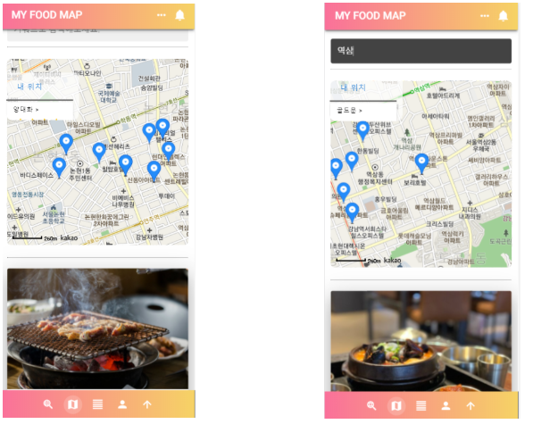
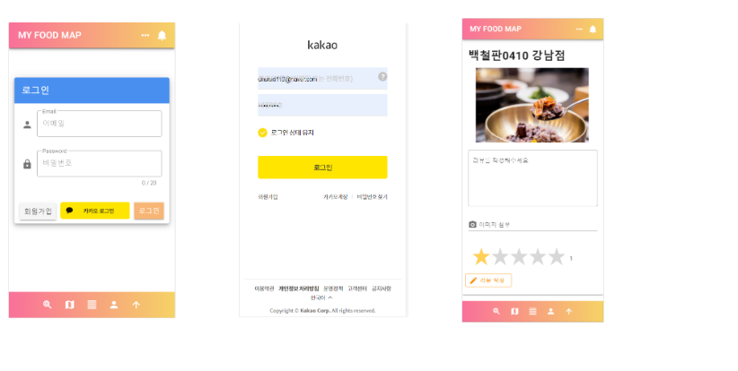
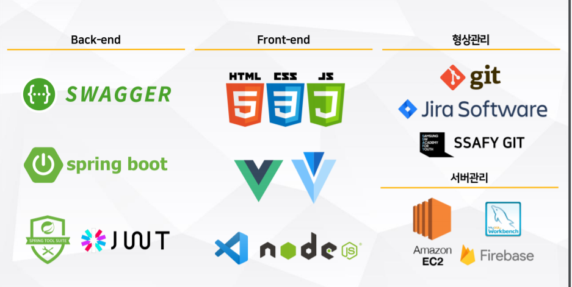
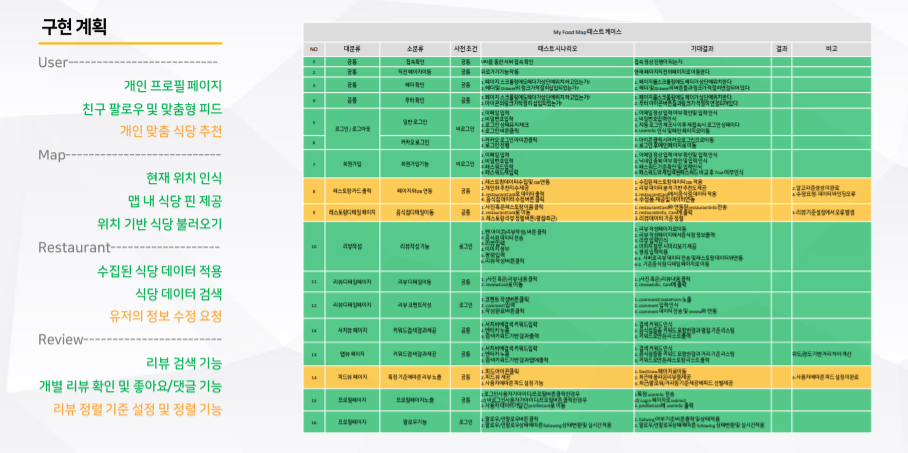

 #SSAFY 공통프로젝트 -  맛집 SNS 웹 

#서울_4반_9조_미바시_

#  README


  

##               

##    접속 주소 : ~~http://i3a409.p.ssafy.io/~~

 

###  🔥 서비스 및 기능 소개 🔥


 1 .  **내 위치 기반 맛집 소개 및 지역별 맛집 검색**

   


2. **높은 평점 순서의 맛집소개 , 가까운 거리 순서로 맛집 소개**

                                     


3. **로그인 및 음식점 리뷰작성**

                    


                   


                


                 


### 😍 팀원 소개 및 역할 😍

------


### 🏳️ 사용 기술 스택 🏳️




## **💡**  구현 계획  **💡** 




### **💡**  [문서](https://lab.ssafy.com/s03-webmobile2-sub3/s03p13a409/tree/master/%EB%AC%B8%EC%84%9C )  **💡**

------


## Local Usage

- vue ( front ) from folder frontend

```
cd frontend

npm install

npm run serve
```


-  Spring ( backend )

  The reference documentation includes detailed installation instructions as well as a comprehensive getting

 [started guide]( https://docs.spring.io/spring-boot/docs/current-SNAPSHOT/reference/html/getting-started.html#getting-started-first-application )


  Here is a quick teaser of a complete Spring Boot application in Java:

  


```
cd backend 

maven update

run Spring boot (backendApplication)
```


-  Mysql 

  Create Database ssafysk

   Running sql file from folder sql( backend )
